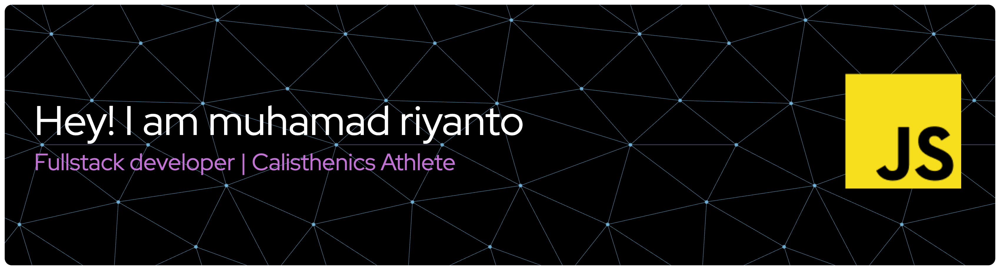

<!--
**muhamadriyanto2025/muhamadriyanto2025** is a ✨ _special_ ✨ repository because its `README.md` (this file) appears on your GitHub profile.

Here are some ideas to get you started:

- 🔭 I’m currently working on ...
- 🌱 I’m currently learning ...
- 👯 I’m looking to collaborate on ...
- 🤔 I’m looking for help with ...
- 💬 Ask me about ...
- 📫 How to reach me: ...
- 😄 Pronouns: ...
- ⚡ Fun fact: ...
-->
- 🔭 I’m currently working on Japan
- 🌱 I’m currently learning Laravel
- 💬 Ask me about programming or calisthenics
- 📫 How to reach me: muhamad.riyanto2025@gmail.com

#### Skills Programming:

#### Skills Frameworks & Library  🚀

#### Skills Operation System:

#### Skills Database:

#### Skills Design: 

#### Education: 

#### Contact With Me:

